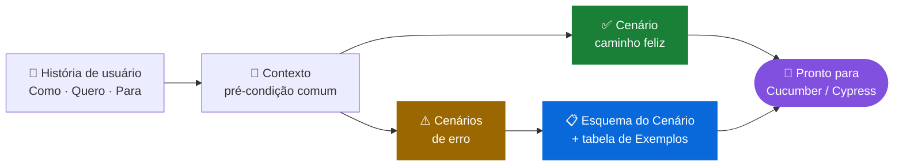
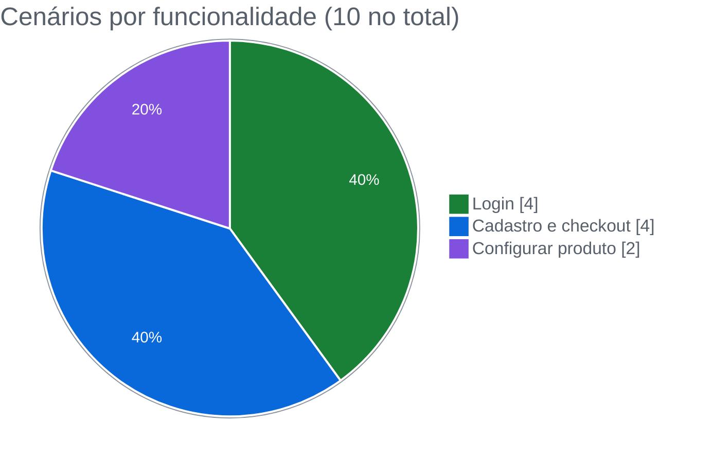
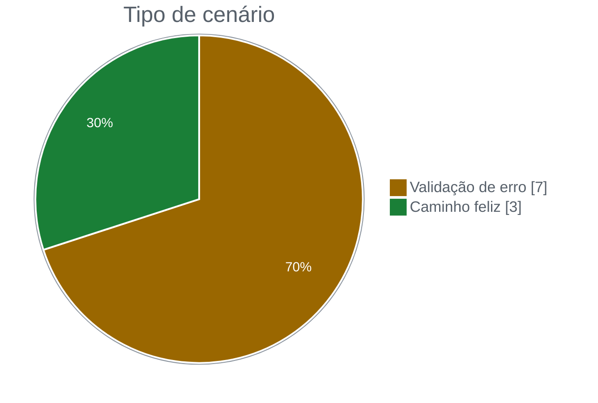
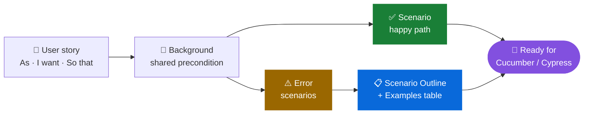

<div align="center">

# 🥒 EBAC Shop · Especificação BDD com Gherkin

**Escrevi em Gherkin os cenários de login, configuração de produto e checkout de um e-commerce, com critérios de aceite prontos para virar teste automatizado**


🇧🇷 [Português](#-português) · 🇺🇸 [English](#-english)

</div>

---

## 🇧🇷 Português

### 🎯 Objetivo

Antes de automatizar qualquer teste, é preciso que time de produto, desenvolvimento e QA concordem sobre **o que o sistema deve fazer**. É para isso que existe o BDD (*Behavior-Driven Development*): descrever o comportamento em linguagem natural, num formato que qualquer pessoa entende e que depois vira teste automatizado.

Nesse projeto, escrevi as especificações de três funcionalidades da **EBAC Shop** a partir de histórias de usuário, usando Gherkin em português.

### 🧭 Estratégia

Para cada funcionalidade, parti da história de usuário e desdobrei em cenários, cobrindo o caminho feliz e, principalmente, os erros que o cliente pode cometer.



**Recursos do Gherkin que usei:**

| Recurso | Para que serve |
|---|---|
| `Funcionalidade` + história de usuário | Deixar claro quem é o usuário, o que ele quer e por quê |
| `Contexto` | Evitar repetir a mesma pré-condição em todos os cenários |
| `Cenário` | Descrever um comportamento específico |
| `Esquema do Cenário` + `Exemplos` | Rodar o mesmo cenário com vários conjuntos de dados |
| `#language: pt` | Escrever em português, próximo de quem usa o produto |

### 🧪 Cobertura





| Funcionalidade | Arquivo | Cenários | O que especifiquei |
|---|---|:-:|---|
| 🔐 Login | `login.feature` | 4 | Autenticação válida, usuário inexistente, usuário ou senha inválidos |
| 🧾 Cadastro e checkout | `checkout.feature` | 4 | Campos obrigatórios em branco e e-mail em formato inválido |
| 👕 Configurar produto | `config.feature` | 2 | Escolha de cor, tamanho e quantidade antes de adicionar ao carrinho |

### 🔍 Destaque: validação de e-mail

No checkout, montei os exemplos de e-mail inválido pensando em **três tipos diferentes de erro**, e não em três variações do mesmo:

| E-mail de teste | Tipo de erro |
|---|---|
| `joãosilva@ebac.com` | Caractere acentuado |
| `joaosilva_EBAC.com` | Falta o `@` |
| `1234` | Só números, sem estrutura de e-mail |

Essa é a lógica de **particionamento de equivalência**: cada linha representa uma classe de entrada inválida, e assim poucos exemplos cobrem muitos casos reais.

### 📈 O que o projeto entregou

- **Escrevi 10 cenários e 9 linhas de exemplos** para três funcionalidades centrais da loja.
- **Dei peso aos cenários de erro:** 7 dos 10 cenários tratam de algo dando errado, que é onde os bugs costumam aparecer.
- **Criei critérios de aceite claros** para cada mensagem que o sistema deve exibir ao usuário.
- **Deixei a especificação pronta para automação:** os arquivos `.feature` podem ser ligados a steps no Cucumber ou no Cypress.

### 🚀 Onde esse trabalho se aplica

- **Refinamento de histórias:** os cenários servem de base para conversar com PO e desenvolvimento antes de o código existir.
- **Documentação viva:** a especificação descreve o comportamento esperado em linguagem que o time todo entende.
- **Automação guiada por comportamento:** cada cenário vira um teste automatizado, mantendo o vínculo com o requisito de negócio.
- **Rastreabilidade:** cada mensagem de erro esperada fica ligada a um cenário, o que facilita saber o que foi validado.

### 📁 Estrutura

```
├── login.feature      # autenticação
├── checkout.feature   # cadastro e finalização da compra
└── config.feature     # configuração de produto
```

---

## 🇺🇸 English

### 🎯 Goal

Before automating any test, product, development and QA need to agree on **what the system should do**. That's what BDD (*Behavior-Driven Development*) is for: describing behavior in natural language that anyone can read and that later becomes an automated test.

In this project I wrote specifications for three **EBAC Shop** features from user stories, using Gherkin in Portuguese.

### 🧭 Strategy



I used `Feature` with user stories, `Background`, `Scenario`, `Scenario Outline` with `Examples`, and `#language: pt`.

### 🧪 Coverage

| Feature | Scenarios | What I specified |
|---|:-:|---|
| 🔐 Login | 4 | Valid login, unknown user, invalid user or password |
| 🧾 Sign-up and checkout | 4 | Empty required fields and invalid email format |
| 👕 Product configuration | 2 | Choosing color, size and quantity before adding to cart |

For invalid emails, I picked **three different error classes** (accented character, missing `@`, numbers only), applying **equivalence partitioning** so a few examples cover many real cases.

### 📈 What the project delivered

- **I wrote 10 scenarios and 9 example rows** for three core store features.
- **I focused on error scenarios:** 7 of the 10 cover something going wrong.
- **I defined clear acceptance criteria** for every message the system must show.
- **The specification is ready for automation** with Cucumber or Cypress.

---

<div align="center">

Feito por **Gustavo Anderson** · QA Engineer
[](https://www.linkedin.com/in/gustavo-anderson)
[](https://github.com/gustavoanderson)

</div>
